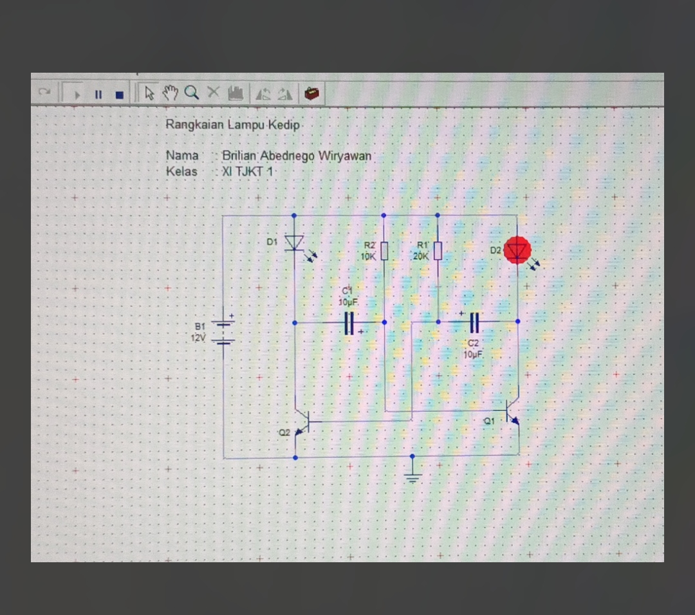
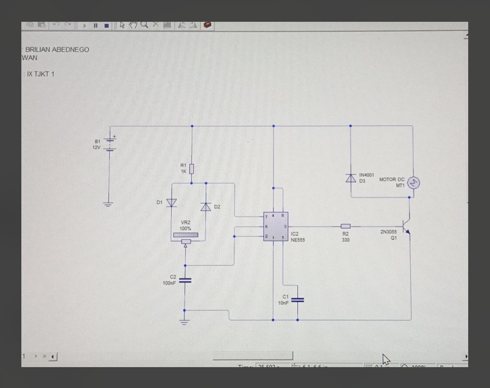
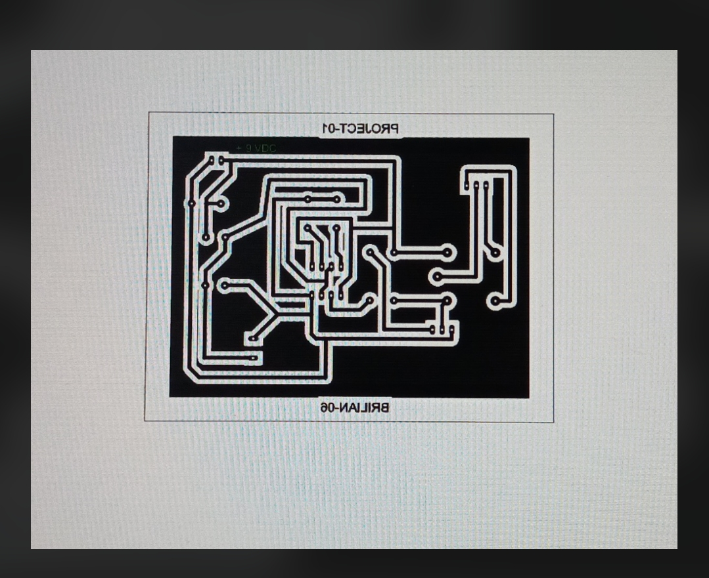
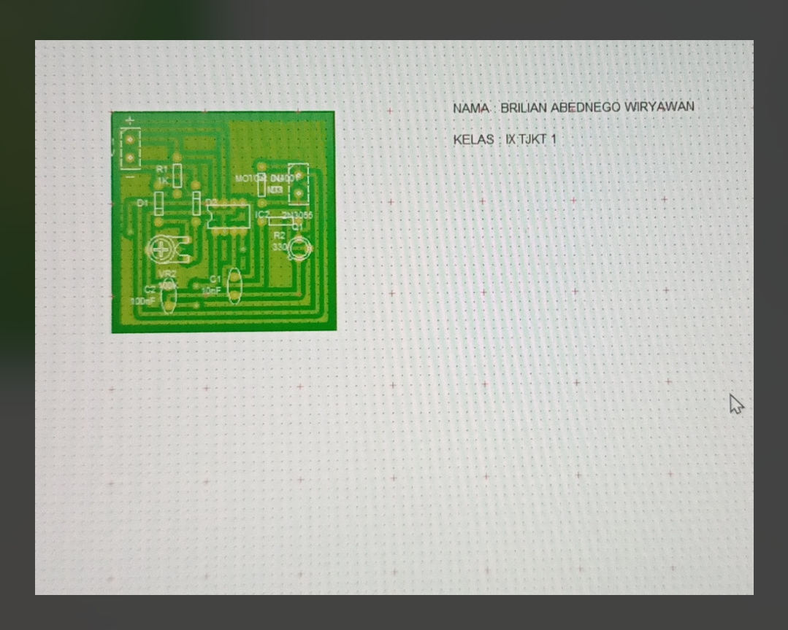
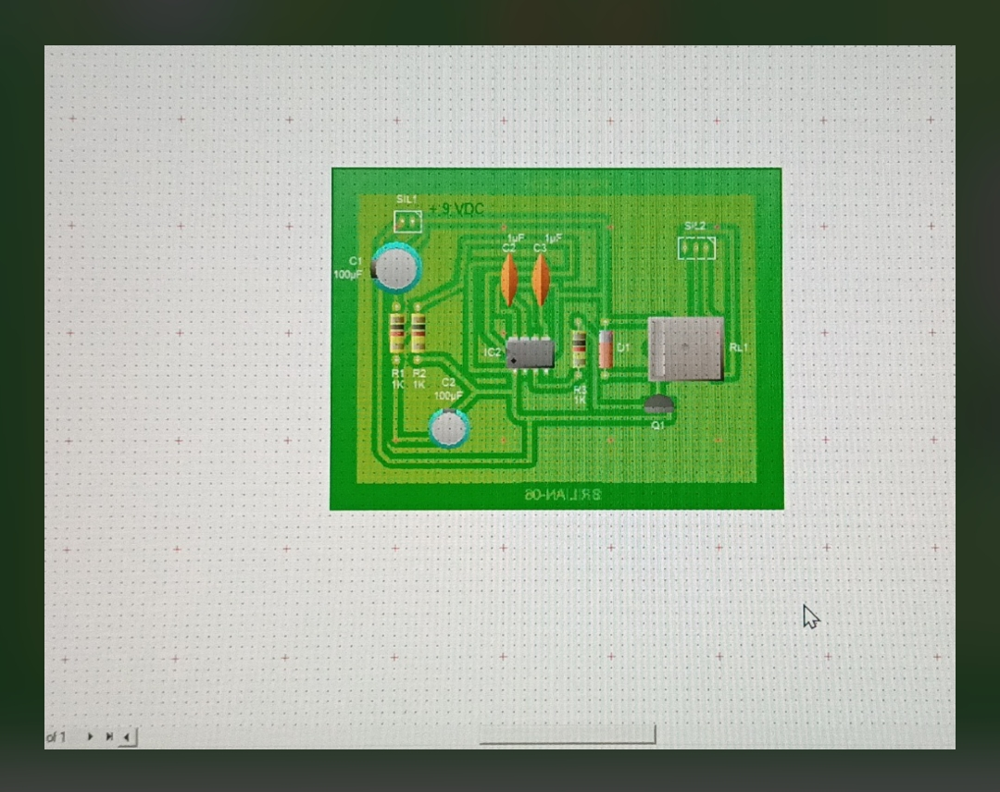

# Portofolio Pengalaman Praktikum TKJ & Jaringan Komputer

Selamat datang di repositori portofolio saya. Repositori ini berisi kumpulan dokumentasi, laporan praktikum (PDF), dan file simulasi proyek yang telah saya kerjakan selama masa studi saya di bidang Teknik Komputer dan Jaringan (TKJ). Proyek-proyek ini mencakup topik simulasi jaringan (Cisco & GNS3), administrasi server (Debian), hingga skema elektronika (PCB).

> 📌 **CATATAN PENTING FOR READERS / PEMBACA:**  
> Penjelasan dan skema pada file `README.md` ini merupakan ringkasan visual & gambaran umum. Untuk melihat **langkah-langkah konfigurasi secara detail, perintah CLI, pengujian konektivitas, serta analisis hasil praktikum**, silakan periksa file laporan tertulis yang tertera pada folder **`Laporan, PDF dan Dokumentasi Hasil Praktik/`**.

---

## 🛠️ Prasyarat Software & Hardware

Untuk menjalankan file simulasi dan mempraktikkan isi laporan di repositori ini, Anda memerlukan komponen-komponen berikut:

### Software & Simulator (Sisi Jaringan/Server)
| Software | Kegunaan | Rekomendasi Versi |
| :--- | :--- | :--- |
| **Cisco Packet Tracer** | Menjalankan simulasi topologi jaringan berbasis Cisco (`.pkt`). | Versi 8.x atau terbaru |
| **GNS3** | Simulator jaringan canggih untuk routing static/dinamis berbasis IOS nyata (`.gns3`). | Versi terbaru |
| **VirtualBox / VMware** | Menjalankan mesin virtual untuk server Debian (Web, Mail, DNS, DHCP). | Terbaru |
| **Winbox** | Aplikasi GUI untuk manajemen Router Mikrotik. | Terbaru |
| **Terminal / SSH Client** | Mengakses server (misal: PuTTY, Terminal Linux/macOS). | N/A |

### Software & Hardware (Sisi Elektronika/Hardware)
| Komponen | Kegunaan |
| :--- | :--- |
| **Livewire / Software PCB** | Membuka dan menguji skema simulasi elektronika (`.lwz` / Livewire). |
| **Perangkat Solder** | Solder, timah, PCB kosong (untuk proyek fisik solder). |
| **Komponen Elektronika** | Transistor (BC547/Q1-Q2), IC 555, Resistor, Kapasitor (10µF/100nF), LED, Dioda 1N4001, Motor DC. |

---

## 📂 Struktur Repositori & Deskripsi Isi

### 1. 📂 Laporan, PDF, dan Dokumentasi Hasil Praktik
Folder ini berisi laporan tertulis lengkap mengenai detail langkah-langkah praktikum.

> 📄 *Silakan buka file PDF masing-masing di folder ini untuk petunjuk dan konfigurasi step-by-step:*

| File (PDF) | Deskripsi Topik Utama |
| :--- | :--- |
| `LAPORAN JOBDESK 1 2 4 CISCO` | Dasar routing dan switching menggunakan Cisco Packet Tracer. |
| `LAPORAN JOBDESK 5` | Topologi jaringan tingkat lanjut & integrasi perangkat. |
| `LAPORAN JOBDESK ospf` | Konfigurasi routing dinamis menggunakan protokol OSPF pada perangkat Cisco. |
| `LAPORAN JOBDESK rip` | Konfigurasi routing dinamis menggunakan protokol RIP pada perangkat Cisco. |
| `LAPORAN GNS3 Routing Static` | Praktikum konfigurasi routing statis pada simulator GNS3 (IOS nyata). |
| `laporan instal ulang windows` | Dokumentasi langkah-langkah instalasi ulang sistem operasi Windows. |
| `laporan instal ulang linux` | Dokumentasi langkah-langkah instalasi ulang sistem operasi Linux (Debian). |
| `MAIL SERVER PADA DEBIAN` | Instalasi dan konfigurasi Postfix/Dovecot (Mail Server) di Debian. |
| `WEB SERVER BRILIAN` | Instalasi dan konfigurasi Apache2/Nginx (Web Server) di Debian. |
| `WORDPRESS PADA DEBIAN` | Deployment CMS WordPress di atas tumpukan LAMP/LEMP di Debian. |
| `Tugas Konfigurasi Debian` | Instalasi & konfigurasi FTP Server, DNS Server (Bind9), dan DHCP Server. |
| `Manajemen User & Hak Akses` | Praktikum administrasi system user, group, dan permission (chmod/chown) di Linux. |
| `Winbox & Tugas Mikrotik` | Konfigurasi dasar Mikrotik (IP, DHCP, NAT, Queue) menggunakan Winbox. |
| `PROJECT BRILIAN SOLDER` | Dokumentasi proyek fisik penyolderan komponen elektronika dasar. |
| `TUGAS GUI` | Tugas terkait pengembangan interface grafis dasar. |

---

### 2. 📂 Simulasi Cisco Packet Tracer & GNS3

Folder ini berisi file asli topologi jaringan (`.pkt` dan `.gns3`) yang dapat dibuka langsung di simulator.

* **Cisco Packet Tracer:** Jobdesk 1-5, Routing Dinamis OSPF, dan Routing Dinamis RIP (`.pkt`).
* **GNS3:** Proyek simulasi routing statis menggunakan router GNS3 (`.gns3`).

#### Contoh Topologi Routing Dinamis RIP (Cisco Packet Tracer)

*Gambar: Contoh topologi praktikum routing RIP.*

#### Contoh Topologi Routing Statis (GNS3)

*Gambar: Contoh topologi praktikum routing statis GNS3.*

> 💡 *Detail alokasi IP, subnetting `/29`, dan tabel routing untuk tiap router tercantum lengkap pada file laporan PDF di repositori.*

---

### 3. 📂 Skema Elektronika & Proyek PCB (Livewire)

Folder ini berisi skema simulasi rangkaian elektronika dasar hingga desain PCB physical layout.

#### A. Rangkaian Lampu Kedip (Astable Multivibrator)
Rangkaian ini memanfaatkan 2 buah transistor dan kapasitor $10\mu\text{F}$ untuk menciptakan efek lampu kedip bergantian (flip-flop):

*Gambar: Skema Rangkaian Lampu Kedip pada Livewire.*

#### B. Skema Kontrol Motor DC / PWM (IC 555)
Skema rangkaian pengatur kecepatan/timer berbasis IC NE555 dan Transistor 2N3055 untuk penggerak Motor DC:

#### C. Desain PCB Layout & Proyek Solder
Visualisasi tata letak PCB (jalur tembaga & penataan komponen) yang digunakan pada praktikum penyolderan:

---

## 👨‍💻 Kontributor

*   **Nama:** Brilian Abednego Wiryawan
*   **Kelas:** XII TKJ 1 / XI TJKT 1

---

*Catatan: Repositori ini disusun sebagai portofolio dokumentasi hasil belajar dan pengujian praktikum Teknik Komputer dan Jaringan.*
